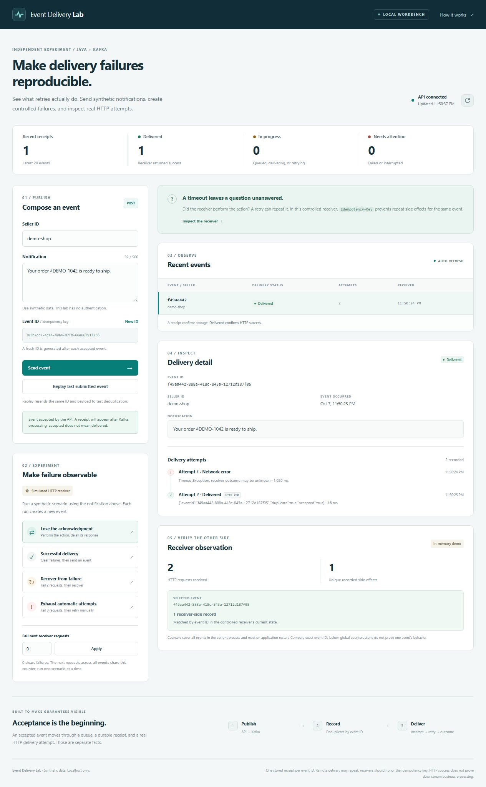

# Event Delivery Lab

**The receiver did the work. The acknowledgment never arrived. Should you retry?**

This local Java/Kafka lab makes that ambiguity reproducible. Send a synthetic notification, delay the receiver's response after it records the action, then inspect the retry. The key comparison is **HTTP attempts versus receiver-side effects**: another request does not have to mean another notification.

The dashboard includes controlled failure drills, an event inspector, HTTP attempt history, explicit recovery, and a receiver that deduplicates by `Idempotency-Key`. A separate automated experiment compares it with deliberately naive receiver behavior.

[Run the failure drills](docs/failure-drills.md) · [Recorded results](docs/results.md) · [Architecture](docs/architecture.md) · [Project purpose](docs/project-brief.md)

**Verified comparison:** the same lost-acknowledgment experiment produced two HTTP requests in both cases: **two side effects** with a naive receiver, **one** with receiver-side idempotency. [Reproduce and interpret the result](docs/results.md#lost-acknowledgment-isolate-the-cause).

## Why I built it

My background includes Java, Kafka, notification services, and integrations. I built this independent experiment to investigate how retries can create duplicate notifications, and to make the recovery behavior observable and testable. The interesting engineering work is at the boundaries: what the queue acknowledged, what the database recorded, and what the receiver actually did.

Development is AI-assisted. The implementation and fixtures are independent work with synthetic data; this repository contains no employer code or data. See [provenance](docs/provenance.md) and the [MIT license](LICENSE).

<details>
<summary>See the running experiment</summary>



</details>

## Run locally

Install a **JDK 17 or newer** and make `java` available on your path. The Maven wrapper downloads Maven and dependencies on the first run. No separate Maven installation, Docker, account, or API key is required.

Clone the repository and enter it:

```sh
git clone https://github.com/Sahreb-Aamir/event-delivery-lab.git
cd event-delivery-lab
```

macOS / Linux:

```sh
./mvnw spring-boot:test-run@local-lab
```

Windows PowerShell:

```powershell
.\mvnw.cmd spring-boot:test-run@local-lab
```

Open [the local workbench](http://127.0.0.1:8080). This command starts a real embedded Kafka broker, the Spring Boot service, an H2 file database, the dashboard, and the controlled HTTP receiver. Stop it with `Ctrl+C`.

The default HTTP, embedded broker, and controller listeners use `127.0.0.1`. This unauthenticated lab is intended for localhost and synthetic data.

### Try the question first

1. Choose **Lose the acknowledgment**. The receiver records the action and delays one response for 2 seconds; the sender's default exchange timeout is 1 second.
2. Inspect the event's attempts. The expected sequence is `NETWORK_ERROR` followed by `SUCCEEDED`.
3. Look at **Receiver observation**. Match the selected event ID to its receiver-side record. Global request and effect counters include every event in the current process.
4. Choose **Replay last submitted event**. The same ID, message, seller, and original timestamp are resubmitted. Once successful delivery is recorded, the consumer skips another HTTP attempt.

Run one scenario at a time: injected failures and delayed acknowledgments share receiver-wide counters. The [failure guide](docs/failure-drills.md) covers temporary errors, exhausted attempts, manual recovery, and the naive-versus-idempotent comparison.

## What this demonstrates

| Boundary | What the lab records | What it does not establish |
| --- | --- | --- |
| API → Kafka | `202` after a broker acknowledgment | That the consumer or receiver has finished |
| Kafka → H2 | One immutable receipt per event ID; exact replays reuse it | That the remote side effect happened |
| Sender → receiver | Each HTTP attempt, outcome, and bounded response detail | A known receiver outcome after a network timeout |
| Controlled receiver | A record keyed by event ID; duplicates reuse it | Durable deduplication across receiver restarts |

An HTTP `2xx` becomes `DELIVERED`. That is evidence of an HTTP success response, not proof of downstream business processing. There is no production exactly-once delivery claim.

## Verify the behavior

```sh
./mvnw verify
```

```powershell
.\mvnw.cmd verify
```

The suite uses an embedded Kafka broker, real local HTTP receivers, and H2. Its checks cover:

| Check | Executable evidence |
| --- | --- |
| Lost acknowledgment: naive receiver versus receiver-side idempotency | [NotificationProcessorTest](src/test/java/dev/sahreb/delivery/NotificationProcessorTest.java) |
| API → Kafka → receipt → HTTP; retries, dead letters, replay, and asynchronous conflicts | [DeliveryIntegrationTest](src/test/java/dev/sahreb/delivery/DeliveryIntegrationTest.java) |
| Concurrent receipt deduplication and persistence after database reopen | [ReceiptStoreTest](src/test/java/dev/sahreb/delivery/ReceiptStoreTest.java) |
| Attempt/state transactions, retained history, and uncertain pending attempts | [DeliveryStoreTest](src/test/java/dev/sahreb/delivery/DeliveryStoreTest.java) |
| Pending intent survives forced writer-process termination | [H2CrashDurabilityTest](src/test/java/dev/sahreb/delivery/H2CrashDurabilityTest.java) |
| Full launcher: receiver observes the event, process is killed, history survives restart and explicit retry | [FullAppCrashRecoveryTest](src/test/java/dev/sahreb/delivery/FullAppCrashRecoveryTest.java) |
| Request validation, broker acknowledgment failures, and receiver controls | [NotificationApiTest](src/test/java/dev/sahreb/delivery/NotificationApiTest.java) |

The full Maven suite and documented local launch have been verified locally. The passing lost-acknowledgment comparison recorded two requests in both cases, two side effects without receiver deduplication, and one with it. See the [reproduction command and scope](docs/failure-drills.md#compare-naive-and-idempotent-receivers) before interpreting those numbers. [GitHub Actions](.github/workflows/verify.yml) is configured to run the Java suite on Java 17 and 21.

The dashboard's pending-receipt and retry-race checks use Node's built-in test runner, with no npm dependencies:

```sh
node --test src/test/js/delivery-tracker.test.cjs
```

Node is needed only for these frontend checks, not to run the application.

The [automated crash drill](docs/failure-drills.md#force-stop-the-full-application) uses a separate process and database. It saves receiver observations, database snapshots, application logs, and recovery results under `target/crash-probe/` so a failure can be investigated.

## Implementation choices

- **Java 17, Spring Boot 4.1.1, Spring Kafka:** explicit request/consumer/receiver boundaries and readable failure handling.
- **H2 file storage and JDBC:** a primary key enforces receipt identity; transactions keep local attempt history and delivery state consistent.
- **Plain HTML, CSS, and JavaScript:** the dashboard reads actual API state, renders text safely, and needs no frontend build or CDN.
- **H2 2.5.250 override:** avoids the cross-connection `CHECK` constraint/session regression described in [H2 issue #4308](https://github.com/h2database/h2database/issues/4308). The schema retains its outcome constraints; database reopen tests exercise persistence.

Kafka makes the queue/consumer boundary visible for the experiment. A simple webhook sender would not inherently need Kafka. If forwarding, inspection, and replay are the main requirement, established tools such as [Hookdeck](https://hookdeck.com/docs/cli) and [Webhook.site](https://docs.webhook.site/) already serve that purpose. This repository focuses on locally controlled failure experiments and the implementation behind them.

## Limits worth understanding

- Hard-stop persistence experiments include an [unresolved earlier loss of a pending attempt](docs/results.md#what-a-harder-test-exposed). Later full-app and subprocess drills passed, but this lab is not a production delivery service or a sole audit record.
- The embedded broker is **ephemeral**. H2 receipts and attempts persist under `data/receipts`, but queued Kafka records, offsets, and dead letters do not survive a fresh embedded-broker run. Persistent database rows do not make the demo a restart-safe delivery system.
- Before starting the fresh demo consumer, the launcher marks unfinished stored events `INTERRUPTED`. Explicit retry is available, while old unfinished attempts retain their unknown outcome. This is a recovery choice, not evidence that no remote action happened.
- The controlled receiver's effects and deduplication map are **in memory** and reset with the application. A stored sender receipt and an empty receiver after restart are possible.
- One partition and one consumer keep the experiment understandable. This is not a distributed delivery-claim or scheduling implementation.
- HTTP failures get up to **3 attempts**, with **250 ms** between retries and a default **1,000 ms** exchange timeout. Storage failures instead retry indefinitely at 1-second intervals and can stall the partition; they are not silently discarded to the dead-letter topic.
- Failed or interrupted valid events can be inspected and explicitly retried in the dashboard. Malformed broker messages and conflicting IDs go to the dead-letter topic; there is no dead-letter browser yet.
- Submission is asynchronous: an accepted event can temporarily return `404` before its receipt exists. A same-ID/different-payload submission can return `202`, then be rejected by the consumer while the original receipt remains unchanged.

The [architecture](docs/architecture.md) documents crash windows, API responses, storage lifetimes, and running against your own broker.

## Next useful steps

Add a read-only dead-letter inspector, persist receiver idempotency records, and automate restart/crash experiments against a persistent broker. Read-only MCP diagnostics are a follow-on; they are not part of this release.
