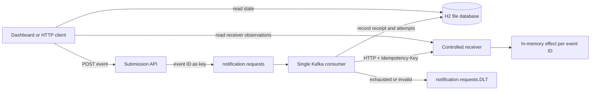

# Architecture and guarantees

Event Delivery Lab makes four separate facts observable: a broker acknowledgment, a local receipt, an HTTP attempt, and a receiver-side effect. Each fact belongs to a different boundary.



The diagram's read paths go through the HTTP API. The browser has no direct database access.

## Submission and consumption

[`NotificationController`](../src/main/java/dev/sahreb/delivery/NotificationController.java) validates an event, serializes it, and sends it to Kafka using its UUID as the key. The producer uses `acks=all` and idempotence. The controller waits for the send result before returning `202` with `{eventId, status: "QUEUED"}`.

A missing acknowledgment produces `503`, but the record may still have reached Kafka. An explicit retry must preserve the original ID **and complete payload**, including `occurredAt`. The dashboard retains that payload for replay and does not automatically resubmit a failed HTTP request.

The Kafka acknowledgment is not a receipt acknowledgment. Immediately reading the event can return `404` until the consumer stores it. The recent-events endpoint contains only recorded receipts, so it is not a queue-depth measure.

[`NotificationProcessor`](../src/main/java/dev/sahreb/delivery/NotificationProcessor.java) validates broker input independently of the HTTP API. It rejects malformed JSON, invalid fields, and records over 16,384 characters. Valid events pass through these steps:

1. Record or verify the immutable receipt.
2. Skip HTTP if successful delivery is already recorded locally.
3. Commit a `PENDING` attempt and `DELIVERING` state.
4. Send HTTP to the configured receiver with `Idempotency-Key: <eventId>`.
5. Record the result as `SUCCEEDED`, `HTTP_ERROR`, or `NETWORK_ERROR`.

`2xx` responses succeed. Other statuses, including redirects, fail; redirects are not followed. The total exchange is bounded by the default 1,000 ms deadline, including a stalled response body. At most 2,048 response-body bytes are retained, with a truncation marker when needed.

## Local identity and delivery state

[`ReceiptStore`](../src/main/java/dev/sahreb/delivery/ReceiptStore.java) relies on the database's `event_id` primary key rather than an in-memory precheck. Concurrent identical inserts converge on one receipt. On duplicate ID, the store compares seller, message, and occurrence time:

- Same ID and same fields: reuse the original receipt without changing its recording time.
- Same ID and different fields: raise an identity conflict and preserve the original.

Conflict detection happens during consumption, after the API can have returned `202`. The conflicting Kafka record goes to the dead-letter topic. The original event's status does not become a conflict indicator.

[`DeliveryStore`](../src/main/java/dev/sahreb/delivery/DeliveryStore.java) uses local database transactions to pair attempt creation with `DELIVERING`, and attempt completion with its resulting state. These transactions protect database consistency; they do not include the remote HTTP call.

| Event state | Meaning |
| --- | --- |
| `QUEUED` | A receipt exists but no delivery state has been recorded yet |
| `DELIVERING` | An attempt has been started and has no recorded result yet |
| `RETRYING` | The latest attempt failed; retry/recovery handling is in progress |
| `DELIVERED` | A successful HTTP result was recorded |
| `FAILED` | Automatic HTTP delivery was exhausted and recovery retained the Kafka record |
| `INTERRUPTED` | A fresh local-demo run found unfinished state from the previous broker; explicit recovery is needed |

An attempt's `PENDING` outcome can survive a crash. It means the sender lacks a recorded result, not that the receiver did nothing. No startup process converts unknown outcomes into invented successes or failures.

## Retries, dead letters, and recovery

[`KafkaConfig`](../src/main/java/dev/sahreb/delivery/KafkaConfig.java) declares a one-partition request topic and matching dead-letter topic, each with replication factor 1. The listener uses one consumer with record acknowledgment and automatic offset commits disabled.

| Failure | Handling |
| --- | --- |
| Non-successful HTTP response or network failure | Initial attempt plus 2 retries, 250 ms apart |
| Exhausted HTTP delivery | Publish to `notification.requests.DLT`, then mark the valid event `FAILED` |
| Malformed or invalid broker event | No delivery retry; retain the record in the dead-letter topic |
| Same ID with conflicting payload | No delivery retry; retain the conflict in the dead-letter topic |
| Database `DataAccessException` | Retry indefinitely at 1-second intervals; the partition can stall |
| Dead-letter publication fails | Recovery throws; the record must not be treated as successfully recovered |

The three-attempt policy is the normal HTTP-failure budget, not an absolute lifetime cap. Explicit recovery, redelivery, crashes, storage failures, or failed dead-letter publication can create further attempts. The retained history makes those attempts visible.

`POST /api/events/{id}/retry` accepts `FAILED` or `INTERRUPTED` events and republishes the original stored payload. It adds to existing attempt history. It does not remove any original dead-letter record. The dashboard supports this path for valid recorded events; it does not currently browse or repair malformed/dead-letter-only records.

The browser tracks acknowledged submissions until it observes a terminal result, including IDs that have not yet appeared as receipts or have left the latest-20 window. A manual retry captures the previous attempt count: an old `FAILED` or `INTERRUPTED` snapshot cannot be mistaken for completion of the newly accepted retry. Shared receiver controls remain locked until a new attempt reaches a terminal state. These pending observations live in the browser, not in a second delivery-state store.

## The controlled receiver

[`DemoReceiverController`](../src/main/java/dev/sahreb/delivery/DemoReceiverController.java) stores a synthetic effect in an in-memory map keyed by event ID. The idempotency header must equal the body's ID. A repeated identical payload returns success with `duplicate: true`; a conflicting payload returns `409`.

Two receiver-wide controls create experiments:

- **Failures:** the next configured requests for unrecorded events return `503` before recording an effect. A duplicate already recorded at the receiver returns its deduplicated result instead.
- **Acknowledgment delay:** after recording or recognizing an effect, selected responses pause for the configured duration. The pause happens outside the receiver lock so another attempt can arrive and see the existing record.

`receivedRequests` counts valid requests that enter receiver processing, including injected failures and duplicates. `sideEffectCount` and `deliveryCount` both expose the number of unique entries in the current receiver map. `deliveries` provides the corresponding event IDs and timestamps. These are process-wide observations, not automatically per-event measures.

This receiver demonstrates deduplication while its process is alive. It does not model a durable external email/SMS action or guarantee idempotency after restart. [The comparison test](failure-drills.md#compare-naive-and-idempotent-receivers) isolates what changes when a receiver ignores the key.

## Persistence and crash windows

| Component | Default storage | Lifetime |
| --- | --- | --- |
| Receipt, delivery state, attempt history | H2 file at `data/receipts` | Persists after normal application restart |
| Embedded Kafka records, offsets, dead letters | Embedded broker storage | Fresh on each demo run |
| Receiver effects, counters, idempotency map | JVM memory | Reset on application restart |
| Replay button's original submitted payload | Browser memory | Reset on page reload |

The H2 configuration uses `WRITE_DELAY=0`. The stores also call [`CHECKPOINT SYNC`](../src/main/java/dev/sahreb/delivery/H2Durability.java) after committing local writes and before returning to the delivery pipeline. This H2-specific boundary asks the database to flush and synchronize its file. A failed sync remains an error; replay resynchronizes before skipping an already delivered event. The tradeoff is additional local disk work per event and attempt.

Persistence tests include graceful database reopen and forced termination of a separate writer JVM while its connection pool is open. They verify the stored receipt, pending attempt, and restart reconciliation. They do not establish power-loss, hardware, or filesystem-corruption guarantees. The [recorded results](results.md) describe an earlier manual crash observation and the limits of its diagnosis.

The important crash window remains: the receiver can perform an effect before the sender commits success. Replaying that event may send HTTP again. Durable receiver-side idempotency would be needed to protect that boundary across receiver restarts. Kafka producer idempotence and the receipt primary key do not close it.

If the embedded broker disappears while an event is pending, the H2 row alone does not recreate its Kafka record. On demo startup, `LocalLab` holds the fresh consumer stopped, marks stored `QUEUED`, `DELIVERING`, and `RETRYING` events as `INTERRUPTED`, then starts consumption. Old attempt rows remain unchanged. This makes unfinished work available for an explicit retry without pretending to know whether the receiver acted.

This reconciliation runs only in the embedded-broker demo launcher. The packaged application using its own broker does not mark existing work interrupted on startup. There is no automatic republishing of interrupted rows, distributed delivery lease, or durable receiver deduplication. Multi-instance scheduling, claim ownership, and cross-system transactions are outside this release.

## API reference

All paths use the local service, by default `http://127.0.0.1:8080`. JSON errors have a `message` and an `errors` list.

| Method / path | Input | Result |
| --- | --- | --- |
| `POST /api/events` | Event object below | `202` after broker acknowledgment; `400` invalid request; `503` acknowledgment unavailable |
| `GET /api/events` | None | Newest 20 recorded events with receipt, status, and attempts |
| `GET /api/events/{eventId}` | UUID | One recorded event, or `404` |
| `POST /api/events/{eventId}/retry` | No body required | `202` for a `FAILED` or `INTERRUPTED` event; `409` for another state; `404` if unknown |
| `GET /api/demo` | None | Receiver controls, global counters, and recorded deliveries |
| `POST /api/demo/failures` | `{"count": 0}`; integer 0–10 | Set upcoming synthetic failures; return receiver state |
| `POST /api/demo/ack-delay` | `{"count": 1, "delayMs": 2000}`; count 0–10, delay 0–5000 | Set delayed acknowledgments; return receiver state |
| `POST /demo/webhook` | Event plus matching `Idempotency-Key` header | Controlled receiver; normal/deduplicated `200`, injected `503`, conflicting payload `409` |

Example synthetic event:

```json
{
  "eventId": "87f0c1ad-d2ca-42bf-a4ce-dbe5348a51cc",
  "sellerId": "demo-shop",
  "message": "Your order #DEMO-1042 is ready to ship.",
  "occurredAt": "2026-10-07T12:00:00Z"
}
```

Generate a new UUID for each new event. Preserve all four fields for an exact replay. `sellerId` must match `demo-[a-z0-9-]+` and be at most 64 characters; `message` must be nonblank and at most 500 characters; `occurredAt` must parse as an instant.

## Runtime configuration

[`LocalLab`](../src/test/java/dev/sahreb/delivery/LocalLab.java) is a development entry point on the test classpath. The named Maven execution `spring-boot:test-run@local-lab` selects this entry point explicitly and starts its embedded broker before the application. [`LocalKafkaBroker`](../src/test/java/dev/sahreb/delivery/LocalKafkaBroker.java) uses Kafka's server/storage APIs with broker and controller listeners bound to `127.0.0.1`, dynamic ports, and temporary storage. Broker test libraries are excluded from the packaged application jar.

To use an existing broker instead, build the application and run the jar:

```sh
./mvnw verify
KAFKA_BOOTSTRAP_SERVERS=127.0.0.1:9092 java -jar target/event-delivery-lab-0.1.0.jar
```

```powershell
.\mvnw.cmd verify
$env:KAFKA_BOOTSTRAP_SERVERS = '127.0.0.1:9092'
java -jar target/event-delivery-lab-0.1.0.jar
```

The broker must be available; Kafka admin configuration fails startup if it cannot connect. This setting supplies bootstrap addresses only, not a complete secured-cluster configuration. Broker persistence and retention remain the operator's responsibility.

| Setting | Default | Purpose |
| --- | --- | --- |
| `PORT` | `8080` | Local HTTP port; the default receiver follows it |
| `KAFKA_BOOTSTRAP_SERVERS` | `127.0.0.1:9092` | Broker addresses for the packaged application |
| `LAB_WEBHOOK_URL` | `http://127.0.0.1:<port>/demo/webhook` | Fixed outbound destination, configured by the operator |
| `lab.webhook-timeout-ms` | `1000` | Total HTTP exchange deadline |

Use a local receiver and synthetic data when changing the destination. The browser cannot supply arbitrary webhook URLs. Demo failure controls affect only the built-in receiver. The service has no authentication, public ingress setup, credentials management, or production hardening; keep it bound to loopback.
